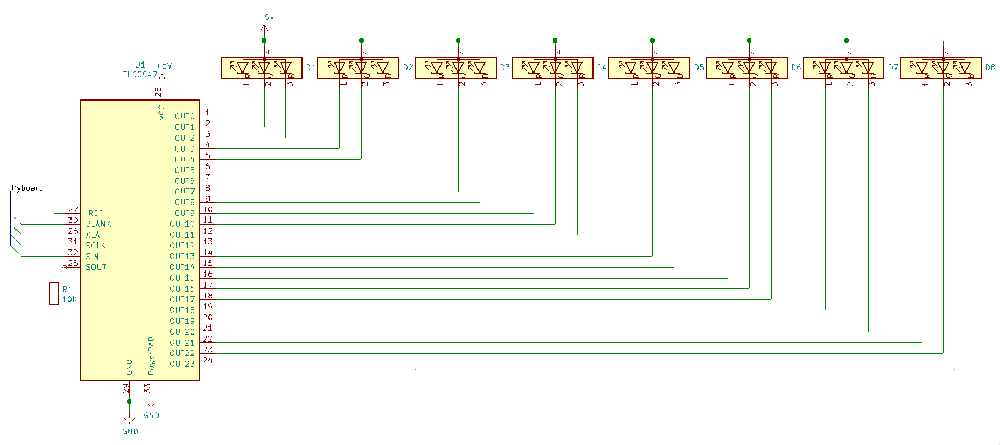

# tlc5947-rgb-micropython

## Table of Contents
+ [About](#about)
+ [Getting Started](#getting_started)
+ [Usage](#usage)

## About <a name = "about"></a>
This is a driver for the [TLC5947](http://www.ti.com/product/TLC5947) 24 Channel 12bit PWM Led driver.

## Getting Started <a name = "getting_started"></a>

### Wiring
This driver is designed for driving RGB LED's that are connected to a TLC5947.
The Wiring of the RGB led's is currently fixed to the order RGB (Red/Green/Blue).

<p align="center"></p>

If your application requires a different type of wiring, please submit an issue.

### Prerequisites
This driver is designed for [micropython](https://github.com/micropython/micropython).

```
git clone --recurse-submodules https://github.com/micropython/micropython.git
```

to compile the project, [make](https://www.gnu.org/software/make/),
[gcc](https://gcc.gnu.org/) and [arm-none-eabi-gcc](https://gcc.gnu.org/) is required,
install them from your package manager

### Installing
[tlc5947-rgb-micropython](https://github.com/peterzuger/tlc5947-rgb-micropython) will only work on the stm32 port.

First create a modules folder next to your copy of [micropython](https://github.com/micropython/micropython).

```
project/
├── modules/
│   └──tlc5947-rgb-micropython/
│       ├──...
│       └──micropython.mk
└── micropython/
    ├──ports/
   ... ├──stm32/
      ...
```

And now put this project in the modules folder.

```
cd modules
git clone https://gitlab.com/peterzuger/tlc5947-rgb-micropython.git
```

Now that all required changes are made, it is time to build [micropython](https://github.com/micropython/micropython),
for this cd to the top level directory of [micropython](https://github.com/micropython/micropython).
From here, first the mpy-cross compiler has to be built:
```
make -C mpy-cross
```

once this is built, compile your port with:
```
make -C ports/stm32/ USER_C_MODULES=../modules CFLAGS_EXTRA=-DMODULE_TLC5947_ENABLED=1
```

and you are ready to use tlc5947.

## Usage <a name = "usage"></a>
The module is available by just importing tlc5947:
```
import tlc5947
```

The documentation for the module is [here](doc/tlc5947.md).
